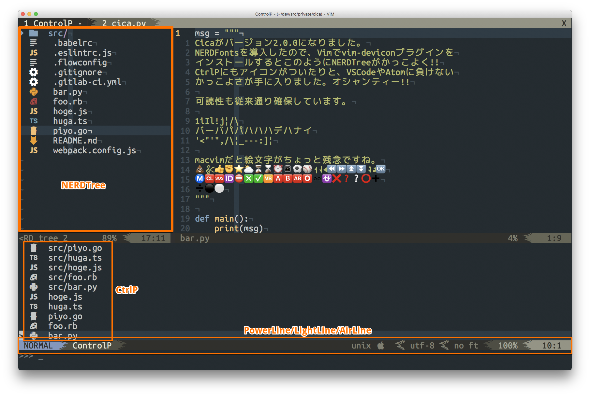
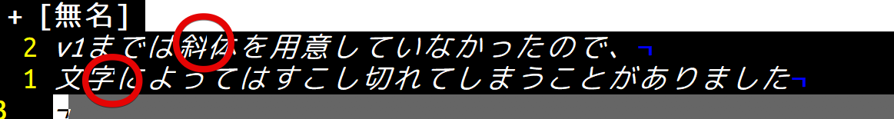
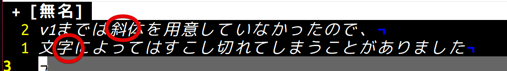
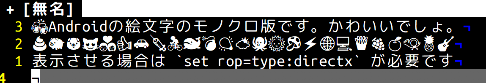
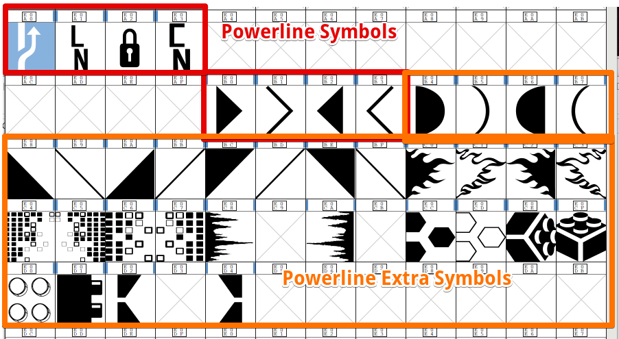

[Cicaフォントv1\.0\.0をリリースしました \| tmnm\.tech](https://tmnm.tech/2016/07/12/cica-font-v1/)
から1年3ヶ月経ちました。自分が使う為に作ったもので特に宣伝などは大きくして
いませんでしたが、やはり使っていただけると嬉しいものですね。

さて、ここにきましてバージョン2をリリースします。

- [ダウンロードはこちらから](https://github.com/miiton/Cica/releases/)
- [Vimでの設定例はこちら](/2017/10/11/vim-setting-with-cica/)

## どういうものか



- 商用利用可能
- パッチなどを当てなくてもあらかじめエディタ(主にvim)に有用な機能を備えている
- 可読性・視認性・判読性が高い
- Windowsでも綺麗
- フォント指定時にスペースを入れるとかアンダーラインを入れるとか気にしなくていい短いフォント名

といったものを目指した日本語プログラミング用フォントです。

v2の変更点の大きくは、v1に [Nerd Fonts](https://nerdfonts.com/) を足したものになります。
(ポモドーロ用のPomiconsだけはライセンスが商用利用不可だったので除外しました)   
vimのプラグインに、VSCodeやAtomっぽくNERDTreeにアイコンを表示させる、
[vim\-devicons](https://github.com/ryanoasis/vim-devicons) と、そのアイコンに色をつける為の
[vim\-nerdtree\-syntax\-highlight](https://github.com/tiagofumo/vim-nerdtree-syntax-highlight)
というプラグインがありまして、これを使いたいが為に生成しました。
vim-deviconsに合わせているので、CicaEに含んでいたDevIconsとUnicodeが変更になっています。

また、今まではCicaとCicaEに分けていましたが、v2 からは Cica だけになります。

その他、今までは [Ricty](https://github.com/kudryavka/Ricty) の生成スクリプトを
ベースにしていましたが、全てPythonに書き換えました。

以下その他のCica 2.0.0のポイントです。

### 斜体を追加





というように斜体になった時に一部切れてしまうのを改善させる為に追加しました。  
ただし完全では無いですし、MacVimではそもそも日本語など斜体表示できない文字があります。

### Noto Emoji

MacVimだとOSの絵文字が優先されてしまいますが、他の環境だと[Noto Emoji](https://github.com/googlei18n/noto-emoji)
が使えます。



### Powerlineのグリフが追加

NER Fontsによって[Powerline Extra Symbols](https://github.com/ryanoasis/powerline-extra-symbols)
というのが追加になっていまして、従来の三角区切りだけではなくて、メラメラ燃えるような
グリフなど色々用意されています。適用後のスクリーンショットは上記リポジトリをご確認ください。




## vimでの使い方

[具体的に書きました](2017/10/11/vim-setting-with-cica/)

以下のように設定します。

**.gvimrc**

```vim
set guifont=Cica:h16
```

正常に表示させる為に以下の設定が必要です。

**.vimrc**

```vim
set encoding=utf8
set ambiwidth=double
```

Windowsのgvimでは以下も設定すると綺麗になります。

```vim
set rop=type:directx,renmode:5
```

以下のVimプラグインも合わせてチェック

- [NERDTree](https://github.com/scrooloose/nerdtree)
  - ファイルエクスプローラー
- [ctrlp.vim](https://github.com/kien/ctrlp.vim)
  - 素早くファイルを開けるにくいやつ
- [vim\-devicons](https://github.com/ryanoasis/vim-devicons)
  - NERDTreeやCtrlPにDevIconsを適用するプラグイン
- [vim\-nerdtree\-syntax\-highlight](https://github.com/tiagofumo/vim-nerdtree-syntax-highlight)
  - NERDTreeに色分けを適用するプラグイン
- [powerline](https://github.com/powerline/powerline)
  - Powerline
- [vim-airline](https://github.com/vim-airline/vim-airline)
  - Powerlineぽいの
- [lightline.vim](https://github.com/itchyny/lightline.vim)
  - 私はこれを使っています

## 心残り

DemiLightとLightを生成しようとしていたのですが、fontforgeが最後まで走ってくれない為に断念しました。
