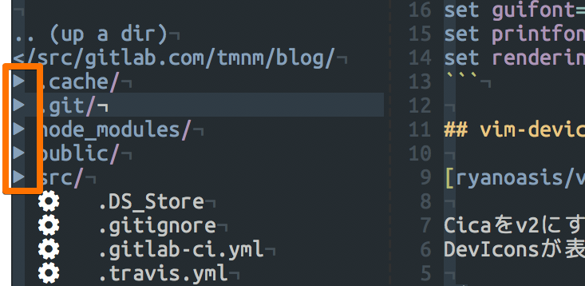
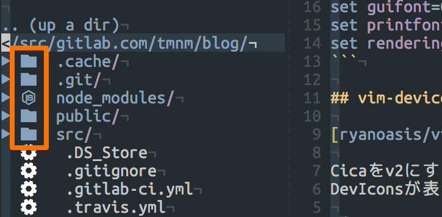
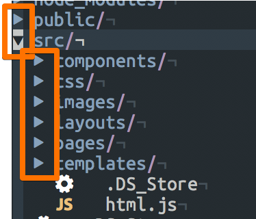
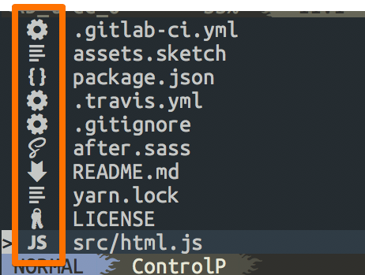
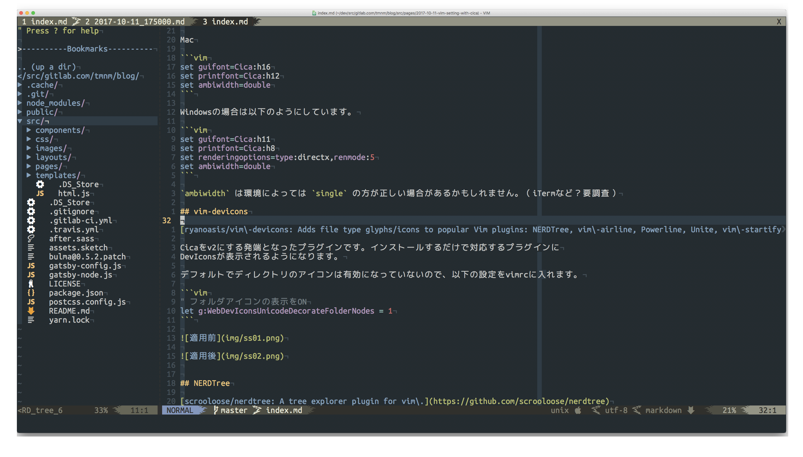

[Cicaフォント](/2017/10/09/cica-v-2/)を使ってVim(GVim、MacVim)をかっこよくする設定のご紹介です。

## 基本設定

Mac

```vim
set guifont=Cica:h16
set printfont=Cica:h12
set ambiwidth=double
```

Windowsの場合は以下のようにしています。

```vim
set guifont=Cica:h11
set printfont=Cica:h8
set renderingoptions=type:directx,renmode:5
set ambiwidth=double
```

`ambiwidth` は環境によっては `single` の方が正しい場合があるかもしれません。（iTermなど？要調査）

## vim-devicons

[ryanoasis/vim\-devicons: Adds file type glyphs/icons to popular Vim plugins: NERDTree, vim\-airline, Powerline, Unite, vim\-startify and more](https://github.com/ryanoasis/vim-devicons)

Cicaをv2にする発端となったプラグインです。Nerd Fontsを含むフォントを設定して、
インストールするだけで対応するプラグインに
[Devicons](http://vorillaz.github.io/devicons/#/dafont)が表示されるようになります。

デフォルトでディレクトリのアイコンは有効になっていないので、以下の設定をvimrcに入れます。

```vim
" フォルダアイコンの表示をON
let g:WebDevIconsUnicodeDecorateFolderNodes = 1
```






## NERDTree

[scrooloose/nerdtree: A tree explorer plugin for vim\.](https://github.com/scrooloose/nerdtree)

超有名プラグインですね。(NERDってオタクという意味なんですね 。) 

ディレクトリの左の三角アイコンを設定しておきます。

```vim
let g:NERDTreeDirArrowExpandable = '▸'
let g:NERDTreeDirArrowCollapsible = '▾'
```




## CtrlP

[ctrlpvim/ctrlp\.vim: Active fork of kien/ctrlp\.vim—Fuzzy file, buffer, mru, tag, etc finder\.](https://github.com/ctrlpvim/ctrlp.vim)

ファイルをサクッと開ける便利プラグインですね。特に必要な設定はありません。

NERDTreeみたいにアイコンに色つけられないかなーとみていたら、vim-jpの皆さまのIssueマター()になっていました。

[set ctrlp buffer's filetype by HerringtonDarkholme · Pull Request \#316 · ctrlpvim/ctrlp\.vim](https://github.com/ctrlpvim/ctrlp.vim/pull/316)



## Powerline / Lightline / AirLine

- [powerline/powerline: Powerline is a statusline plugin for vim, and provides statuslines and prompts for several other applications, including zsh, bash, tmux, IPython, Awesome and Qtile\.](https://github.com/powerline/powerline)
- [itchyny/lightline\.vim: A light and configurable statusline/tabline plugin for Vim](https://github.com/itchyny/lightline.vim)
- [vim\-airline/vim\-airline: lean & mean status/tabline for vim that's light as air](https://github.com/vim-airline/vim-airline)

私はLightlineを使っていて以下のように設定しています。せっかくなので燃えてるやつを設定しています。

```vim{15-16}
let g:lightline = {
            \ 'colorscheme': 'jellybeans',
            \ 'active': {
            \   'left': [ [ 'mode', 'paste' ],
            \             [ 'fugitive', 'filename' ] ]
            \ },
            \ 'component_function': {
            \   'fugitive': 'LightLineFugitive',
            \   'readonly': 'LightLineReadonly',
            \   'modified': 'LightLineModified',
            \   'filename': 'LightLineFilename',
            \   'filetype': 'LightLineFiletype',
            \   'fileformat': 'LightLineFileformat',
            \ },
            \ 'separator': { 'left': '', 'right': '' },
            \ 'subseparator': { 'left': '', 'right': '' }
            \ }

function! LightLineModified()
    if &filetype == "help"
        return ""
    elseif &modified
        return "+"
    elseif &modifiable
        return ""
    else
        return ""
    endif
endfunction

function! LightLineReadonly()
    if &filetype == "help"
        return ""
    elseif &readonly
        return ""
    else
        return ""
    endif
endfunction

function! LightLineFugitive()
    if exists("*fugitive#head")
        let _ = fugitive#head()
        return strlen(_) ? ''._ : ''
    endif
    return ''
endfunction

function! LightLineFilename()
    return ('' != LightLineReadonly() ? LightLineReadonly() . ' ' : '') .
                \ ('' != expand('%:t') ? expand('%:t') : '[No Name]') .
                \ ('' != LightLineModified() ? ' ' . LightLineModified() : '')
endfunction

function! LightLineFiletype()
  return winwidth(0) > 70 ? (strlen(&filetype) ? &filetype . ' ' . WebDevIconsGetFileTypeSymbol() : 'no ft') : ''
endfunction

function! LightLineFileformat()
  return winwidth(0) > 70 ? (&fileformat . ' ' . WebDevIconsGetFileFormatSymbol()) : ''
endfunction
```

PowerlineとAirlineは `vim-devicons` のREADMEの設定例をご確認ください（投

## 完成！

でーん。



