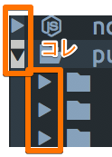

[2.0をリリース](/2017/10/09/cica-v-2/) してから、Twitterを見ていますとぼちぼち
不具合をつぶやいてくれている方がいらっしゃいましたので、それを拾いあげて修正に
こぎつけました。特に [@hnakamur2](https://twitter.com/hnakamur2)さん、
[@shiena](https://twitter.com/shiena)さん表示確認などご協力いただきありがとうございました！

おかげさまで目立つ不具合はあらかた片付いたと思います。

## 修正点

### v2.0.1

NERDTreeなどで表示される(できる)ディレクトリ展開の三角アイコンのグリフが
含まれておらず、macOSのシステムフォントが表示？されており、かつ表示が
欠けていたので、グリフを追加しました。

### v2.0.2

- [このIssue](https://github.com/miiton/Cica/issues/15)

IntelliJ IDEAというIDEでカーソル行などの表示がおかしくなるというお話をみかけて
行間を修正しました。

### v2.0.3

- [このIssue](https://github.com/miiton/Cica/issues/16)
- [このIssue](https://github.com/miiton/Cica/issues/17)

職場で使っていて、WindowsのCmderというターミナルエミュレータでgjyが欠けることや、
``と`` あたりのPowerlineで右寄せにならないといけないグリフが右寄せになっていない
のに気づいたのと、TwitterでmacOSのTerminal.appでgjyが欠けるお話をみかけまして修正しました。

### v2.0.4

- [このIssue](https://github.com/miiton/Cica/issues/18)

tmuxのペイン分割で表示される罫線がずれるという、エンジニアとしてはとっても気になる
不具合を報告いただき修正しました。

## その他

Cicaフォントをインストールした状態で https://miiton.github.io/Cica を表示すると
Private Use Areaに登録されているPowerlineやDeviconsなどのグリフ一覧を表示できる
ページを用意しました。コピペもできますのでご利用ください。

気になる点などありましたら、GitHub Issuesに日本語で大丈夫なのでお気軽に記載頂ければ
できるだけ対応いたします。

- グリフのずれ
- このグリフ追加したらvimがかっこよくなる！

などなど
