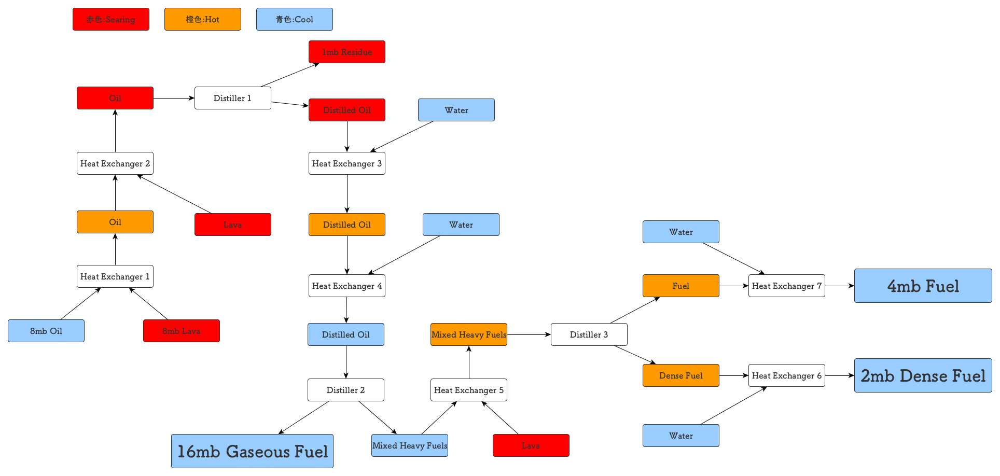
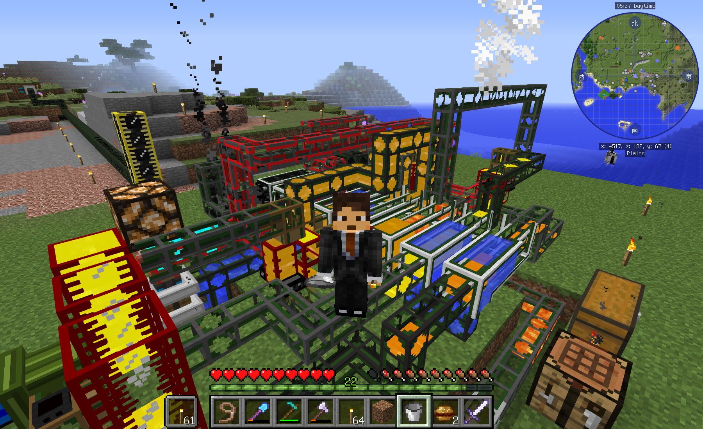

はじめてからすでに結構経つんですが、もっぱらMinecraftに時間割いていて他の活動が停滞しているという状況です。（おい

発端は子供(5歳)がMinecraftやりたい！という事でiPhoneに入れたんですが、自分がどハマり
してしまい、バニラな環境では飽き足らず工業系のModを入れて遊びたい欲が出て、Macにも
インストールしてBuildCraftやIndustrialCraftやらForestryやら導入して遊んでいます。
さっきマグマダイブ決めたのでちょっと休憩して書いています。

バージョンは1.12.2をやっています。このバージョンのBuildCraftはまだα版でロボット
などがいないので少し寂しいですが、ビルダーやクァーリーといったザ・工業機械といった
ものは使えるのでそれで楽しんでいます。このバージョン(7.99.15-pre1)のBuildCraftのバージョンですが、
内燃エンジンの燃料となる液体の生成がかなり過去のバージョンと異なっており、
Wikiなどにも情報が少ない＆ややこしいのでフローチャートを作って確認しながら設置しました。

このフローにしたがって設置すれば8mbあたり16mbのGaseous Fuel（気体燃料）と4mbのFuel（燃料）と2mbのDense Fuel（濃縮燃料）が
生成できますという内容で、おそらくこれが綺麗な形かなー？と思います。廃油が出てもよければもっと簡単にできそうですが。

ちなみにこの装置動かすと熱交換器のところで煙があがったりしてとても工場感が出ます。素敵です。

参考 : [A complete guide to 1\.11 BuildCraft fuels : feedthebeast](https://www.reddit.com/r/feedthebeast/comments/6veugt/a_complete_guide_to_111_buildcraft_fuels/)

Heat Exchanger（熱交換器）ですが、3ブロックで1セットの装置で、1ブロック作るのに鉄インゴットが
12個必要で、このフローを完成させるのに7台必要なので、12 * 3 * 7 で 252個の鉄インゴットが必要というなかなか大変な装置。
IndustrialCraftの粉砕機を利用させてもらいました。

ちなみに完成した燃料の用途ですが、

- Gaseous Fuelは8MJ/tですが、燃焼時間が短いのでレーザーなどに使うと良いと思います。
- Fuelは6MJ/tでなかなか燃焼時間が長いので、一番広く使いやすいかなと思います。
- Dense Fuelは4MJ/tですが、燃焼時間がかなり長いので、64x64のクァーリーに内燃エンジン4つ×Dense Fuelでかなり掘れます。多分Y64から岩盤までいけるかも(2018/1/20追記:全然無理やった)。40000mb貯めるのが時間かかりますが。

バニラな環境は子供と仲良くiPhoneで遊んでいます。
