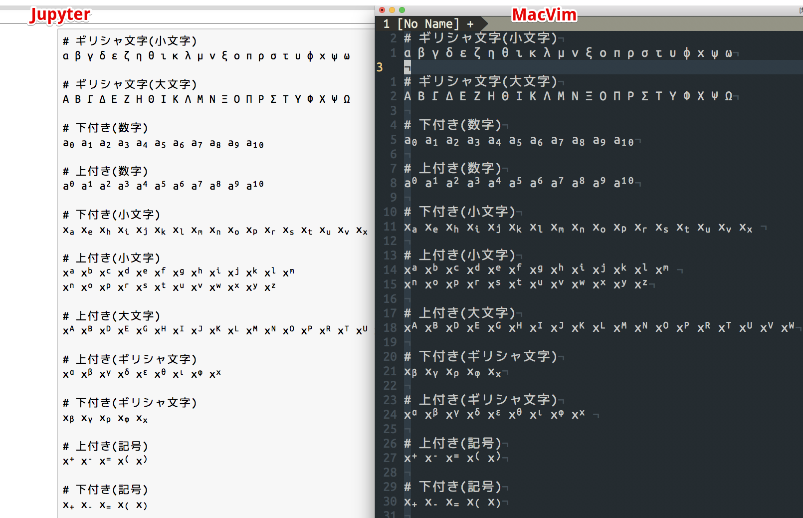
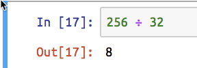

[Cica](https://github.com/miiton/Cica/releases) v2.1.0 をリリースしました。
今回は主に[Julia言語](https://julialang.org/)ユーザーの皆さま向けのアップデートですね。



**[ダウンロードはこちらから](https://github.com/miiton/Cica/releases)**

## 対応したIssue

- [上付き、下付き文字の大きさを少し大きくする · Issue \#22 · miiton/Cica](https://github.com/miiton/Cica/issues/22)
- [FontAwesomeではみ出ているグリフがある · Issue \#19 · miiton/Cica](https://github.com/miiton/Cica/issues/19)

## 今回のアップデートのきっかけは以下のツイート

<blockquote class="twitter-tweet" data-partner="tweetdeck"><p lang="ja" dir="ltr"><a href="https://twitter.com/hashtag/Julia%E8%A8%80%E8%AA%9E?src=hash&amp;ref_src=twsrc%5Etfw">#Julia言語</a> では上付き下付き文字を多用する。例えば、<br><br>E₁ とか σ² とか。あと、偏微分を uₜ, uₓₓ とか。<br><br>私が現在使っているフォントでは上付き下付き文字が小さくて読み難い。<br>この辺を見易くしてくれたプログラミング用のフォントが欲しいです。</p>&mdash; 黒木玄 Gen Kuroki (@genkuroki) <a href="https://twitter.com/genkuroki/status/961211685846446080?ref_src=twsrc%5Etfw">February 7, 2018</a></blockquote>
<script async src="https://platform.twitter.com/widgets.js" charset="utf-8"></script>

おおなるほどな、という事で見てみると、確かにCica 2.0.5 を含む既存のプログラミングフォントの  
上付き文字(SUPERSCRIPTS)、下付き文字(SUBSCRIPTS)は小さくて見づらいです。  
というわけでこれらのグリフのサイズをかなり大きめの、元になるグリフ(上付きの0なら0)の  
75%にして、かつ、通常のグリフと区別がつきやすいようにベースラインをずらすといった工夫をしてみました。

## Julialangについて

そもそもコードを書くときに上付き文字、下付き文字を使う事ってある？と思いますが、  
[Julia](https://julialang.org/) は変数に使えるんですね。とっても研究者フレンドリーな言語だと思います。  
(一応R言語とPythonとGolangとJavaScript(ChromeのDevTools)で試してみましたが上付き、下付きは
変数には使えませんでした。)

あとJulia言語が面白いなと思ったのは除算が `/` はもちろん`÷` でもOKというのが面白いですね。  
(Cicaはこのあたりの記号を半角幅にしているのでコードに混ざっても違和感ありませんね！)



他にも意外性のある機能が盛りだくさん。以下の記事が読みやすかったです。

[Juliaという速くて書きやすい言語をちょっとだけ覗いてみたんだが、なにやらワクワクするものがあったので報告しようと思う \- Qiita](https://qiita.com/sadayuki-matsuno/items/fc5e9ec3894a4b7bfbfb)

Dockerを導入している環境であれば以下のコマンドで(Jupyter公式のDockerイメージで)
簡単にJuliaが使えるJupyterを試せます。

```sh
docker run -it --rm -p 8888:8888 jupyter/datascience-notebook
```

ところで上付き文字めっちゃあるんですけどJupyter上でどうやって入力スルノ...？と思ったら  
[Jupyter Notebookでギリシャ文字を簡単に入力するには \- Qiita](https://qiita.com/alchemist/items/0ce850770d8cc3df0ab4)  
Jupyterがサポートしているんですね。すごい。
